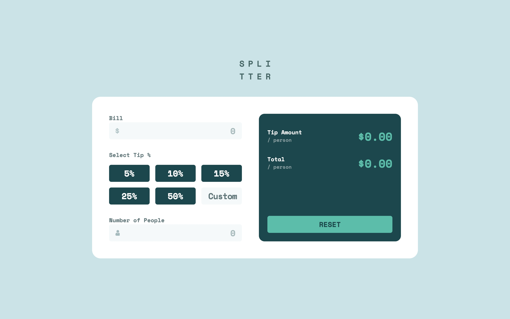
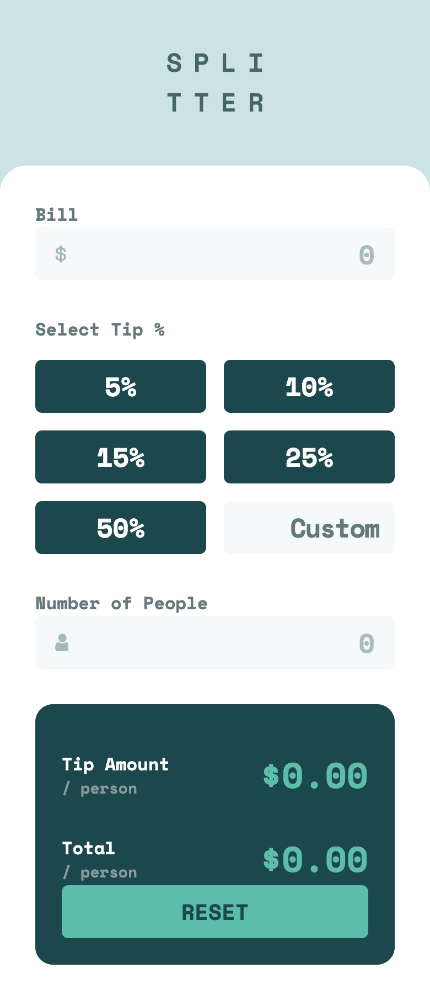

# Frontend Mentor - Tip calculator app solution

This is a solution to the [Tip calculator app challenge on Frontend Mentor](https://www.frontendmentor.io/challenges/tip-calculator-app-ugJNGbJUX). Frontend Mentor challenges help you improve your coding skills by building realistic projects.

## Table of contents

- [Overview](#overview)
  - [The challenge](#the-challenge)
  - [Screenshot](#screenshot)
  - [Links](#links)
- [My process](#my-process)
  - [Built with](#built-with)
  - [What I learned](#what-i-learned)
  - [Continued development](#continued-development)
  - [Useful resources](#useful-resources)
- [Author](#author)

## Overview

### The challenge

Users should be able to:

- View the optimal layout for the app depending on their device's screen size
- See hover states for all interactive elements on the page
- Calculate the correct tip and total cost of the bill per person

### Screenshot

Desktop

Mobile

### Links

- [Live Site URL](https://tip-calculator-app.frilly.dev/)

## My process

### Built with

- **As** semantic **as** possible HTML5 markup
- [Vue](https://vuejs.org/)
- [Tailwind CSS](https://tailwindcss.com/)
- [Astro](https://astro.build/)

### What I learned

This was my first app built with so much interactivity, and Vue made it so much simpler than plain JavaScript. Had some hickups with the `v-model` directive, but I got it working in the end.

### Continued development

I'd like to continue getting more comfortable with Vue and Tailwind.

### Useful resources

- [Vue - Component v-model](https://vuejs.org/guide/components/v-model.html)

## Author

- Website - [frilly.dev](https://frilly.dev)
- Frontend Mentor - [@hikawi](https://www.frontendmentor.io/profile/hikawi)
